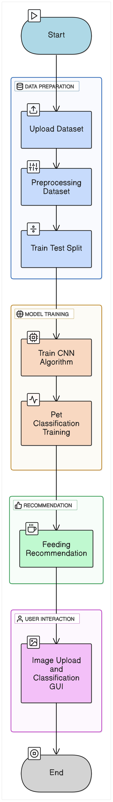
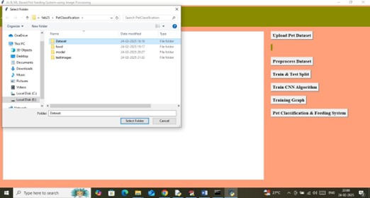
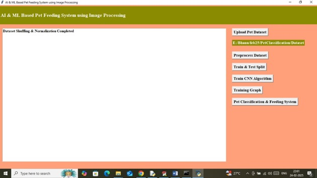
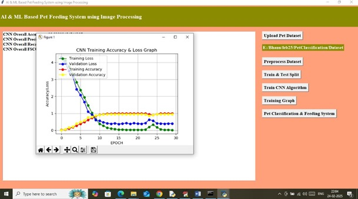
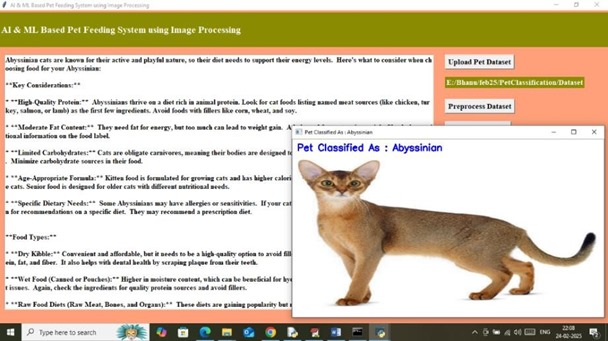

# 🐾 AI and ML-Based Pet Feeding System 🐶🐱

## 🚀 Project Overview
This project implements an AI and machine learning-based pet feeding system designed to classify pet species using image recognition and provide tailored feeding recommendations. The system uses a *Convolutional Neural Network (CNN)* built with *TensorFlow* to analyze pet images, classify the species, and output relevant feeding details such as pet name, recommended food, and nutrition information.

---

## ✨ Features
- 📁 Upload pet image dataset via the GUI interface  
- 🧹 Automated preprocessing of the uploaded dataset (resizing, normalization, augmentation)  
- 🔀 Dataset splitting into training and testing sets (*80:20* ratio)  
- 🧠 CNN model training with real-time display of training progress and graphs  
- 📊 Visualization of:  
  - Training loss  
  - Validation loss  
  - Training accuracy  
  - Validation accuracy  
- 🐕 Upload a new pet image to classify and receive personalized feeding recommendations  
- 🖥 User-friendly GUI developed in *Python*

---

## 🛠 Project Workflow

1. 🗂 *Upload Pet Dataset*  
   Upload your labeled pet image dataset through the GUI interface.

2. 🔄 *Preprocessing Dataset*  
   Images are resized, normalized, and augmented for training.

3. 📊 *Data Splitting*  
   Dataset split into training and testing subsets (*80:20* ratio).

4. 🏋‍♂ *CNN Model Training*  
   Train the CNN model on preprocessed training data.

5. 📈 *Training Visualization*  
   Real-time graphs display:  
   - 📉 Training loss  
   - 📉 Validation loss  
   - ✅ Training accuracy  
   - ✅ Validation accuracy

6. 🐾 *Pet Image Classification*  
   Upload a pet image and classify the species.

7. 🍖 *Feeding Recommendations*  
   Output includes:  
   - Pet species name  
   - Recommended food  
   - Nutrition details tailored for your pet
---

## 📷 Snapshots
###  Block Diagram  

### 📤 Uploading the Pet Dataset  

### 📊 Dataset Summary and Preprocessing  

### 📈 Training Graph Visualization  

### 🤖 Pet Classification and Food Recommendation  

---

## 🧰 Technologies Used
- 🐍 *Python*  
- 🔮 *TensorFlow* (CNN model)  
- 📷 *OpenCV* (image processing)  
- 🖼 *Tkinter* (GUI)  
- 📉 *Matplotlib* (graphs)

---
